## Part 1. Инструмент **ipcalc**

**== Задание ==**

### Подними виртуальную машину (далее -- ws1)

- 1.1. Сети и маски

    1. Адрес сети 192.167.38.54/13
    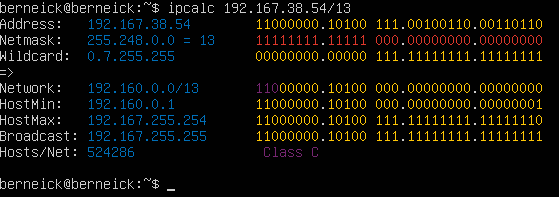

    2.
    - Перевод маски 255.255.255.0 в префиксную и двоичную запись
      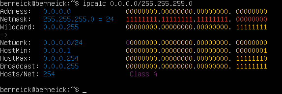
      - префиксная - 24
      - двоичная - 11111111.11111111.11111111.00000000
    
    - Перевод маски /15 в обычную и двоичную 
      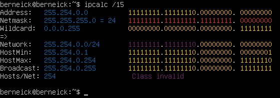
      - обычная - 255.254.0.0
      - двоичная - 11111111.11111110.00000000.00000000

    - *11111111.11111111.11111111.11110000* в обычную и префиксную
      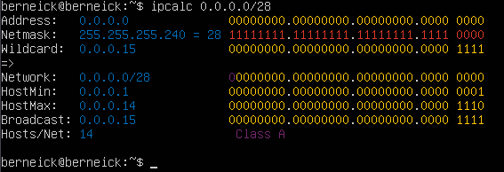
      - обычная - 255.255.255.240
      - префиксная - 28

    3. Минимальный и максимальный хост в сети *12.167.38.4* при масках: 
    - */8*

      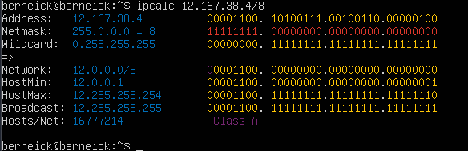
      - минимальный - 12.0.0.1
      - максимальный - 12.255.255.254
    
    - *11111111.11111111.00000000.00000000*

      
      - минимальный - 12.167.0.1
      - максимальный - 12.167.255.254
    
    - *255.255.254.0* и */4*

      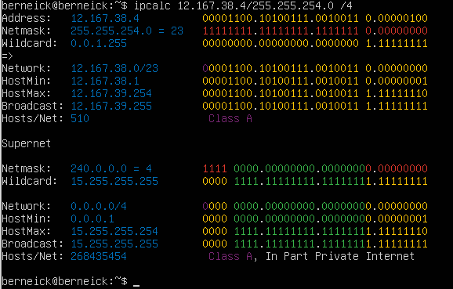
      - минимальный 255.255.254.0 - 12.167.38.1
      - максимальный 255.255.254.0 - 12.167.39.254
      - минимальный /4 - 0.0.0.1
      - максимальный /4 - 15.255.255.254

- 1.2 localhost
  - Определить и записать в отчёт, можно ли обратиться к приложению, работающему на localhost, со следующими IP:

    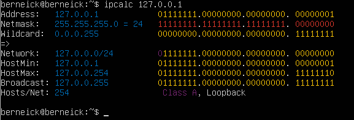

    - *194.34.23.100* - нельзя,
    - *127.0.0.2* - можно, 
    - *127.1.0.1* - нельзя, 
    - *128.0.0.1* - нельзя

- 1.3. Диапазоны и сегменты сетей

  1. Какие из перечисленных IP можно использовать в качестве публичного, а какие только в качестве частных:
    
      Частные ip-адреса
      1. От 10.0.0.0 до 10.255.255.255 с маской 255.0.0.0 или /8
      2. От 172.16.0.0 до 172.31.255.255 с маской 255.240.0.0 или /12
      3. От 192.168.0.0 до 192.168.255.255 с маской 255.255.0.0 или /16
      4. От 100.64.0.0 до 100.127.255.255 с маской подсети 255.192.0.0 или /10;

    - *10.0.0.45* - частный,
    - *134.43.0.2* - публичный,
    - *192.168.4.2* - частный,
    - *172.20.250.4* - частный,
    - *172.0.2.1* - публичный,
    - *192.172.0.1* - публичный,
    - *172.68.0.2* - публичный,
    - *172.16.255.255* - частный,
    - *10.10.10.10* - частный,
    - *192.169.168.1* - публичный
  
  2. Какие из перечисленных IP адресов шлюза возможны у сети *10.10.0.0/18*:
    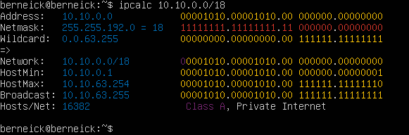
    - *10.0.0.1* - невозможен,
    - *10.10.0.2* - возможен,
    - *10.10.10.10* - возможен,
    - *10.10.100.1* - невозможен,
    - *10.10.1.255* - возможен

## Part 2. Статическая маршрутизация между двумя машинами

**== Задание ==**

### Подними две виртуальные машины (далее -- ws1 и ws2).

### С помощью команды `ip a` посмотри существующие сетевые интерфейсы.

  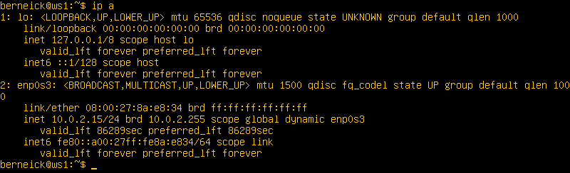
  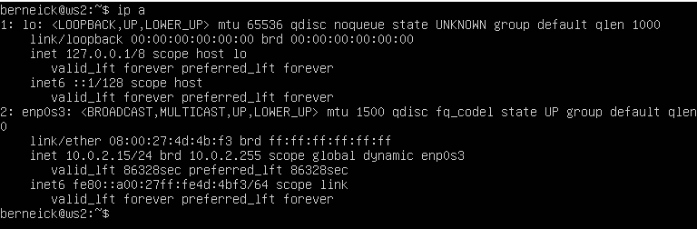

### Опиши сетевой интерфейс, соответствующий внутренней сети, на обеих машинах и задать следующие адреса и маски: ws1 - *192.168.100.10*, маска */16*, ws2 - *172.24.116.8*, маска */12*.

  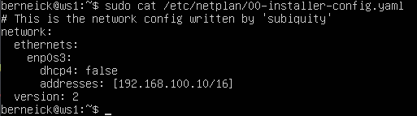
  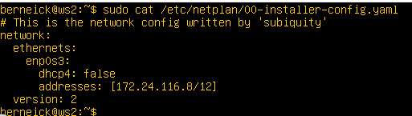

### Выполни команду `netplan apply` для перезапуска сервиса сети.

  
  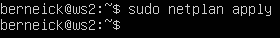

- 2.1. Добавление статического маршрута вручную
  - Добавляю статический маршрут от одной машины до другой и обратно при помощи команды вида `ip r add`.
  - Пингую соединение между ними

  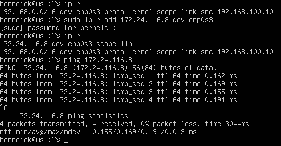
  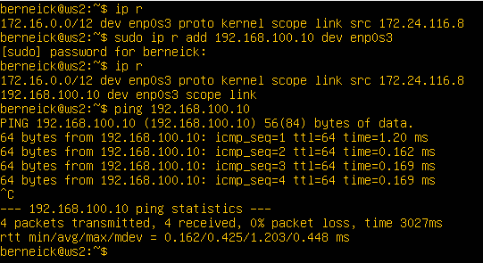

- 2.2. Добавление статического маршрута с сохранением
  - Перезапусти машины. sudo reboot
  - Добавляю статический маршрут от одной машины до другой с помощью файла *etc/netplan/00-installer-config.yaml*.
  - Пингую соединения

  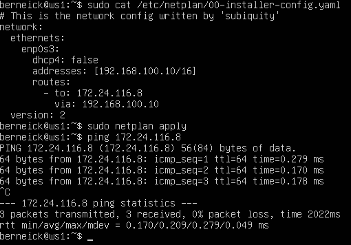
  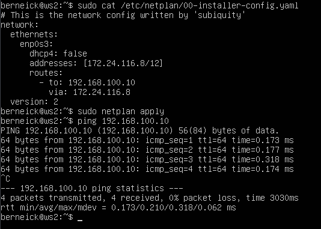

## Part 3. Утилита **iperf3**

**== Задание ==**

- 3.1. Скорость соединения
  
  Перевести: 
  - 8 Mbps = 1 MB/s,
  - 100 MB/s = 819200 Kbps,
  - 1 Gbps = 1024 Mbps.

- 3.2. Утилита **iperf3**

  Сначала настраиваю адаптеры сети на обоих машинах (один адаптер NAT, второй на внутреннюю сеть)

  
  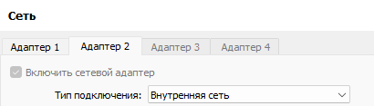

  Затем меняю yaml файлы на обеих машинах

  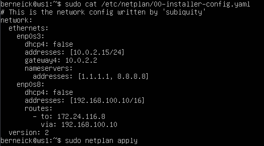
  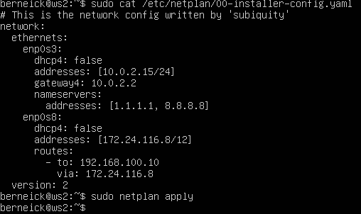

  Устанавливаю iperf3 на обе машины

  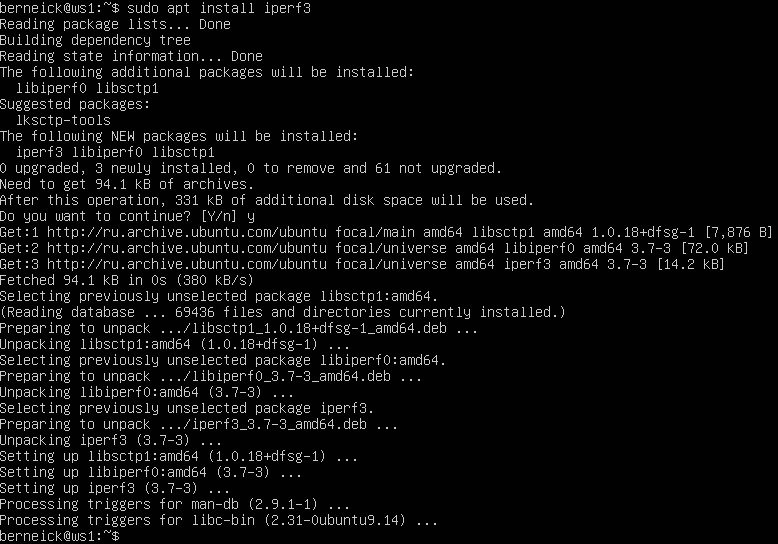

  Измеряю скорость соединения между ws1 и ws2.

  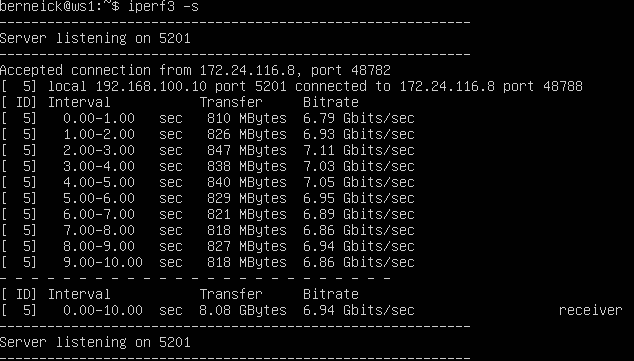
  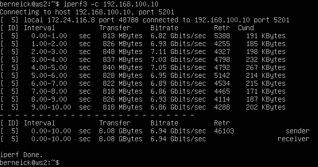

## Part 4. Сетевой экран

**== Задание ==**

- 4.1. Утилита **iptables**

  - Создать файл */etc/firewall.sh*, имитирующий фаерволл, на ws1 и ws2:

  ```shell
  #!/bin/sh

  # Удаление всех правил в таблице «filter» (по-умолчанию).
  iptables -F
  iptables -X
  ```

  - touch /etc/firewall.sh;
  - nano /etc/firewall.sh;

  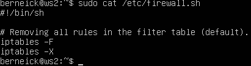

  Нужно добавить в файл подряд следующие правила:
    - 1. На ws1 примени стратегию, когда в начале пишется запрещающее правило, а в конце пишется разрешающее правило (это касается пунктов 4 и 5).
    - 2. На ws2 примени стратегию, когда в начале пишется разрешающее правило, а в конце пишется запрещающее правило (это касается пунктов 4 и 5).
    - 3. Открой на машинах доступ для порта 22 (ssh) и порта 80 (http).
    - 4. Запрети *echo reply* (машина не должна «пинговаться», т.е. должна быть блокировка на OUTPUT).
    - 5. Разреши *echo reply* (машина должна «пинговаться»).

  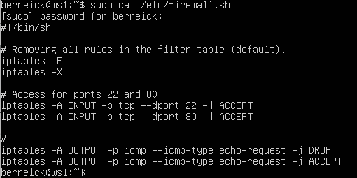
  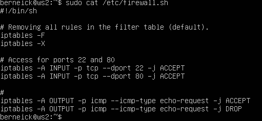

  
  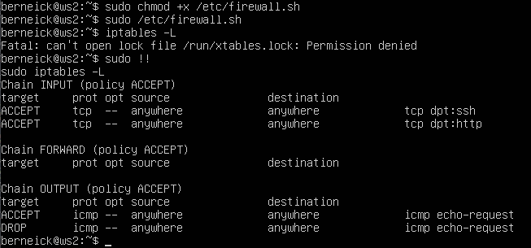

  Разница в том, что цепочка выполняется до первого подходящего правила. В первом случае будет запрет, а во втором разрешение

- 4.2. Утилита **nmap**

  - Командой **ping** найди машину, которая не «пингуется», после чего утилитой **nmap** покажи, что хост машины запущен.

  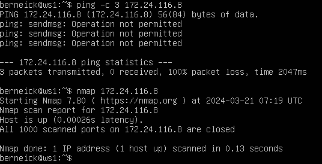
  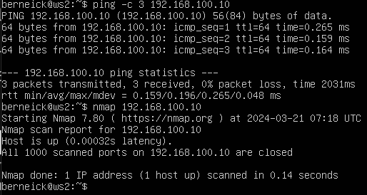

## Part 5. Статическая маршрутизация сети

**== Задание ==**

### Подними пять виртуальных машин (3 рабочие станции (ws11, ws21, ws22) и 2 роутера (r1, r2)).

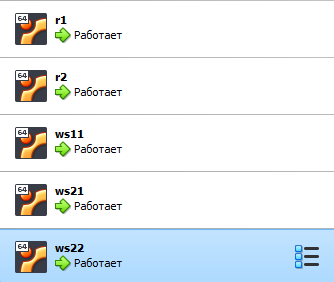

В настройках сети для машин r1 и r2 ставлю дополнитель 2 адаптера на внутреннюю сеть, а для рабочих станций по 1 адаптеру

- 5.1. Настройка адресов машин

  - Настроиваю конфигурации машин в *etc/netplan/00-installer-config.yaml* согласно сети на рисунке.

  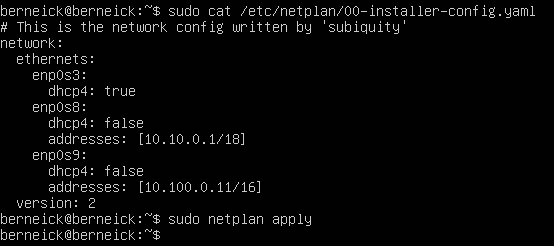
  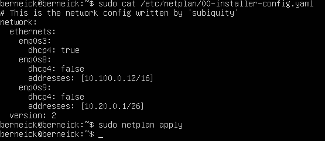
  
  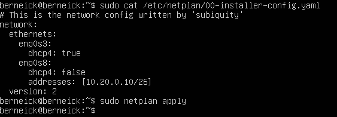
  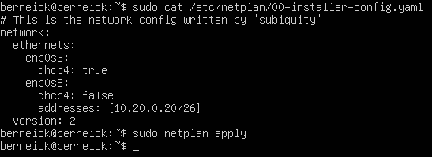

  - Перезапусти сервис сети. Если ошибок нет, то командой `ip -4 a` проверь, что адрес машины задан верно. Также пропингуй ws22 с ws21. Аналогично пропингуй r1 с ws11.

  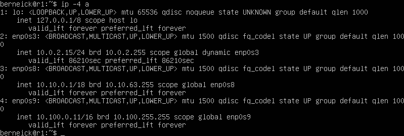
  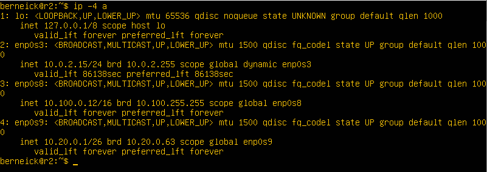
  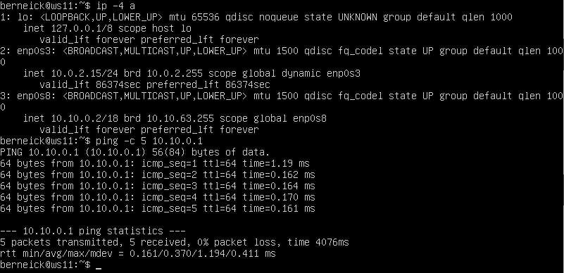
  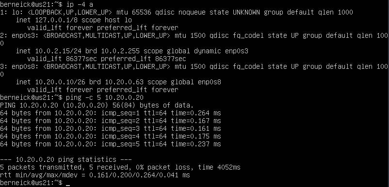
  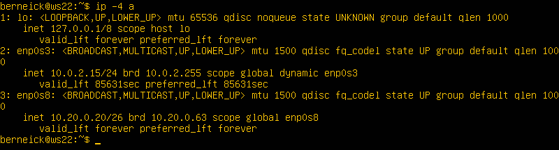

- 5.2. Включение переадресации IP-адресов

  - Для включения переадресации IP, выполни команду на роутерах:
`sysctl -w net.ipv4.ip_forward=1`

  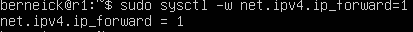
  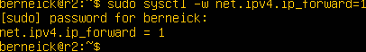

  - Открой файл */etc/sysctl.conf* и добавь в него следующую строку:
`net.ipv4.ip_forward = 1`

  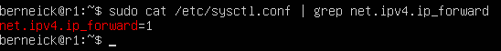
  

- 5.3. Установка маршрута по-умолчанию

  - Настрой маршрут по-умолчанию (шлюз) для рабочих станций. Для этого добавь `default` перед IP роутера в файле конфигураций.

  - Вызови `ip r` и покажи, что добавился маршрут в таблицу маршрутизации.

  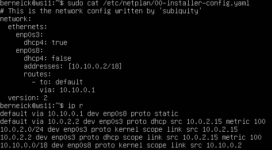
  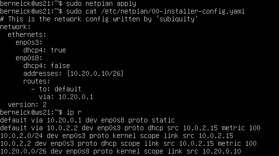
  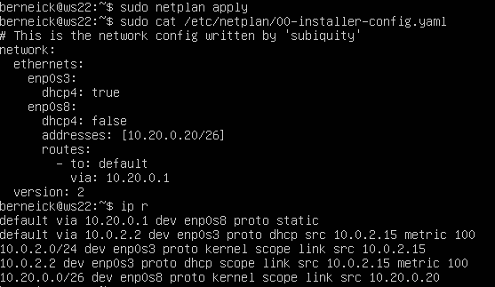

  - Пропингуй с ws11 роутер r2 и покажи на r2, что пинг доходит. Для этого используй команду:
`tcpdump -tn -i eth0`

  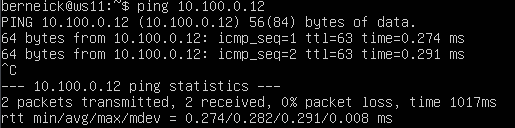
  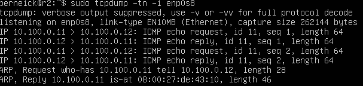

- 5.4. Добавление статических маршрутов

  - Добавь в роутеры r1 и r2 статические маршруты в файле конфигураций. Пример для r1 маршрута в сетку 10.20.0.0/26:

    ```shell
    # Добавь в конец описания сетевого интерфейса eth1:
    - to: 10.20.0.0
      via: 10.100.0.12
    ```

  - Вызови `ip r` и покажи таблицы с маршрутами на обоих роутерах.

  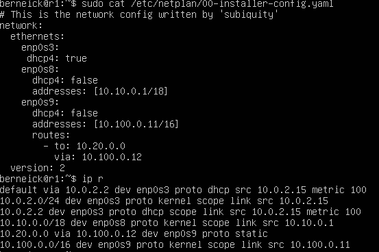
  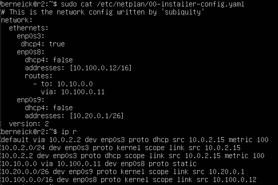

  - Запусти команды на ws11:
  `ip r list 10.10.0.0/[маска сети]` и `ip r list 0.0.0.0/0`

  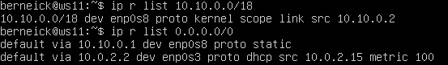

  Для маршрута 10.10.0.0 есть правило, поэтому используется созданный маршрут,
  маршруты по умолчанию используются если правил нет, поэтому для 0.0.0.0/0 показывает только дефолтные значения

- 5.5. Построение списка маршрутизаторов 

  - Запусти на r1 команду дампа
  `tcpdump -tnv -i eth0`
  
  

  - При помощи утилиты **traceroute** построй список маршрутизаторов на пути от ws11 до ws21.

  
  >Принцип работы построения пути при помощи команды traceroute основан на отправке серии пакетов к заданному удаленному узлу с последовательным увеличением значения TTL (Time to Live) в заголовке IP пакета. \
  >Когда пакет достигает маршрутизатора на пути к удаленному узлу, TTL уменьшается на единицу. Если TTL становится равным нулю, маршрутизатор отбрасывает пакет и отправляет обратно ICMP сообщение о превышении времени жизни (TTL exceeded). Таким образом, отправитель traceroute может определить IP адреса маршрутизаторов на пути к удаленному узлу.

- 5.6. Использование протокола **ICMP** при маршрутизации

  - Запусти на r1 перехват сетевого трафика, проходящего через eth0 с помощью команды:
  `tcpdump -n -i eth0 icmp`

  

  - Пропингуй с ws11 несуществующий IP (например, *10.30.0.111*) с помощью команды:
  `ping -c 1 10.30.0.111`

  

## Part 6. Динамическая настройка IP с помощью **DHCP**

**== Задание ==**

### Для r2 настрой в файле */etc/dhcp/dhcpd.conf* конфигурацию службы **DHCP**:

  1) Укажи адрес маршрутизатора по-умолчанию, DNS-сервер и адрес внутренней сети. Пример файла для r2:
  ```shell
  subnet 10.100.0.0 netmask 255.255.0.0 {}

  subnet 10.20.0.0 netmask 255.255.255.192
  {
      range 10.20.0.2 10.20.0.50;
      option routers 10.20.0.1;
      option domain-name-servers 10.20.0.1;
  }
  ```

   

  2) В файле *resolv.conf* пропиши `nameserver 8.8.8.8`. 

  

### Перезагрузи службу **DHCP** командой `systemctl restart isc-dhcp-server`. Машину ws21 перезагрузи при помощи `reboot` и через `ip a` покажи, что она получила адрес. Также пропингуй ws22 с ws21.

  

  - Выставляю настройки для ws21

  

  - Проверяю, что получен новый адрес
  
  

  - Пингую до ws22

  

### Укажи MAC адрес у ws11, для этого в *etc/netplan/00-installer-config.yaml* надо добавить строки: `macaddress: 10:10:10:10:10:BA`, `dhcp4: true`.

    

  - Также необходимо добавить мас адрес в настроках сети для виртуальной машины

### Для r1 настрой аналогично r2, но сделай выдачу адресов с жесткой привязкой к MAC-адресу (ws11). Проведи аналогичные тесты.

   
   
   
   

  - Пингую до ws22

   

### Запроси с ws21 обновление ip адреса.

  - ip адрес до обновления

   

  - Освобождаю старый адрес командой `dhclient -r`, можно добавить конкретный интерфейс

   

  - Запрашиваю новый адрес командой `dhclient`

   

## Part 7. **NAT**

**== Задание ==**

### В файле */etc/apache2/ports.conf* на ws22 и r1 измени строку `Listen 80` на `Listen 0.0.0.0:80`, то есть сделай сервер Apache2 общедоступным.

   
   

### Запусти веб-сервер Apache командой `service apache2 start` на ws22 и r1.

   
   

### Добавь в фаервол, созданный по аналогии с фаерволом из Части 4, на r2 следующие правила:

  1) Удаление правил в таблице filter - `iptables -F`;
  2) Удаление правил в таблице "NAT" - `iptables -F -t nat`;
  3) Отбрасывать все маршрутизируемые пакеты - `iptables --policy FORWARD DROP`.

  - Прописываю и запускаю

   

### Проверь соединение между ws22 и r1 командой `ping`.

  - Соединение не пингуется

   

### Добавь в файл ещё одно правило:
  4) Разрешить маршрутизацию всех пакетов протокола **ICMP**.

  

### Проверь соединение между ws22 и r1 командой `ping`.

  

### Добавь в файл ещё два правила:

  5) Включи **SNAT**, а именно маскирование всех локальных ip из локальной сети, находящейся за r2 (по обозначениям из Части 5 - сеть 10.20.0.0).

  6) Включи **DNAT** на 8080 порт машины r2 и добавить к веб-серверу Apache, запущенному на ws22, доступ извне сети.

  

### Проверь соединение по TCP для **SNAT**: для этого с ws22 подключиться к серверу Apache на r1 командой:
`telnet [адрес] [порт]`

  

### Проверь соединение по TCP для **DNAT**: для этого с r1 подключиться к серверу Apache на ws22 командой `telnet` (обращаться по адресу r2 и порту 8080).

  

## Part 8. Дополнительно. Знакомство с **SSH Tunnels**

### Запусти на r2 фаервол с правилами из Части 7.

  

### Запусти веб-сервер **Apache** на ws22 только на localhost (то есть в файле */etc/apache2/ports.conf* измени строку `Listen 80` на `Listen localhost:80`).

  

### Воспользуйся *Local TCP forwarding* с ws21 до ws22, чтобы получить доступ к веб-серверу на ws22 с ws21.

  - Подключаюсь к ws21 c ws22(`ssh 10.20.0.10`)

  

  - Пробрасываю соединение с ws21 до ws22

  

  - Проверяю ws21 `telnet 127.0.0.1 8080`

  

### Воспользуйся *Remote TCP forwarding* c ws11 до ws22, чтобы получить доступ к веб-серверу на ws22 с ws11.

  - Подключаюсь c ws11 сначала к r2(`ssh 10.100.0.12`)

  

  - Через r2 подключаюсь к ws22(`ssh 10.20.0.20`)

  

  - Пробрасываю туннель от ws22 до ws11(`ssh -R 10.10.0.2:8080:127.0.0.1:80 10.10.0.2`)

  

  - Проверяю `telnet 127.0.0.1 [локальный порт]`

  
